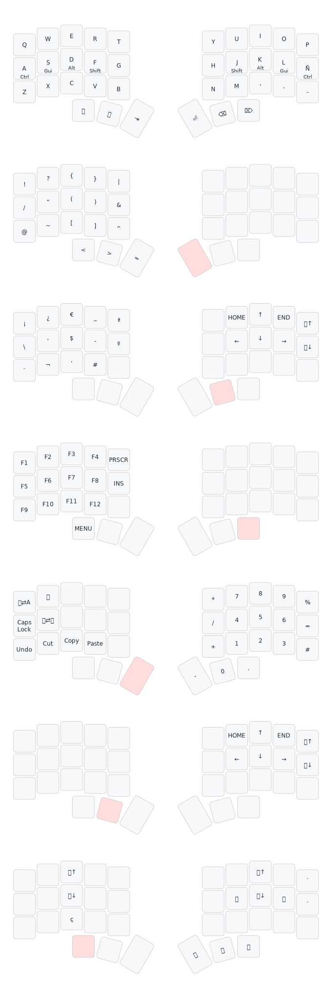

# QMK keymap

This is my keymap 3x5 spanish implementation for [foostan/crkbd corne keyboard](https://github.com/foostan/crkbd).



## Prerequisites

### 1. qmk_firmware repo cloned/forked

To use this corne keymap you need to have the [qmk_firmware repo](https://github.com/qmk/qmk_firmware) cloned/forked.

### 2. QMK CLI installed and setup

You can find how to setup QMK on the [QMK Firmware docs website](https://docs.qmk.fm/newbs_getting_started#set-up-your-environment).

## Installation guide

### 3. Clone the  repo

Clone this repo under crkbd/keymaps in your qmk_firmware repository.

For example:

```sh
git clone https://github.com/MarcSepia/qmk_crkbd_sepia_3x5.git <your_qmk_repo_path>/keyboards/crkbd/keymaps/sepia_3x5
```
